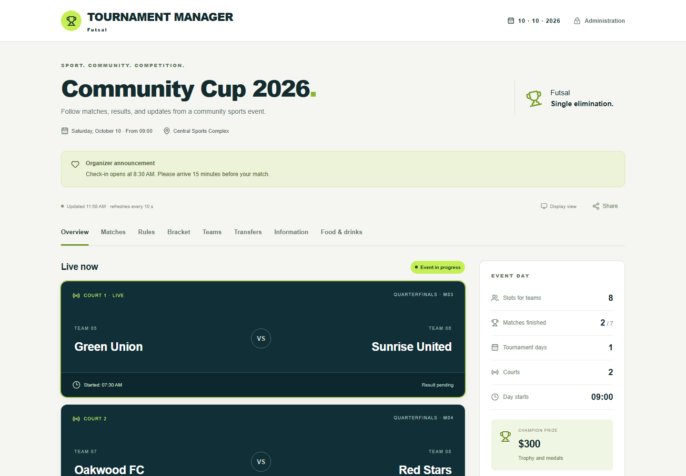
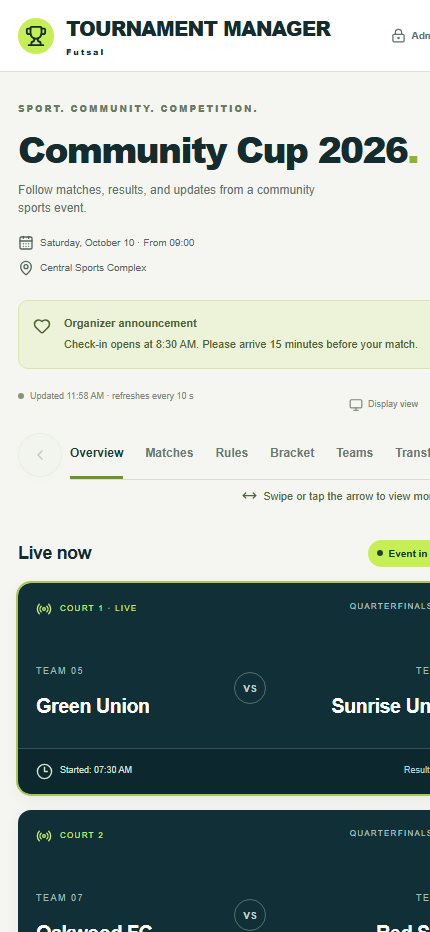
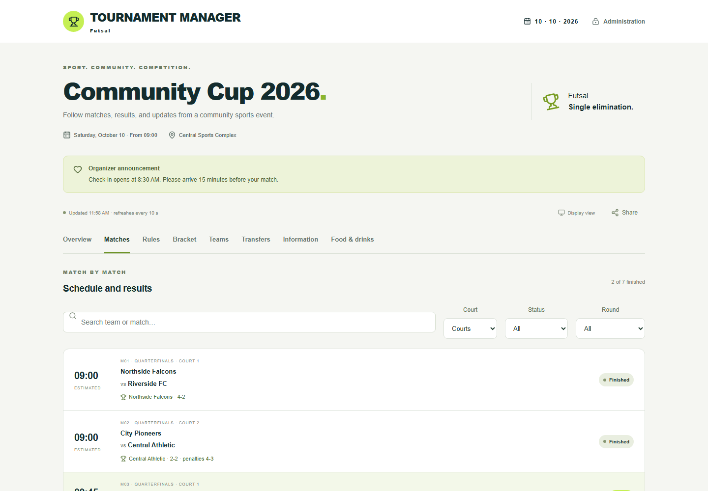
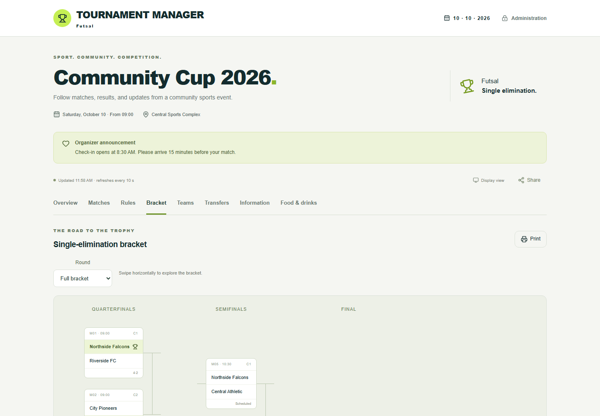
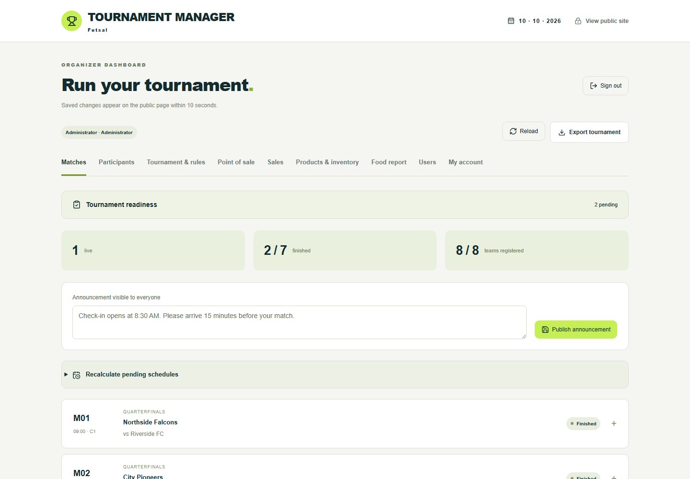
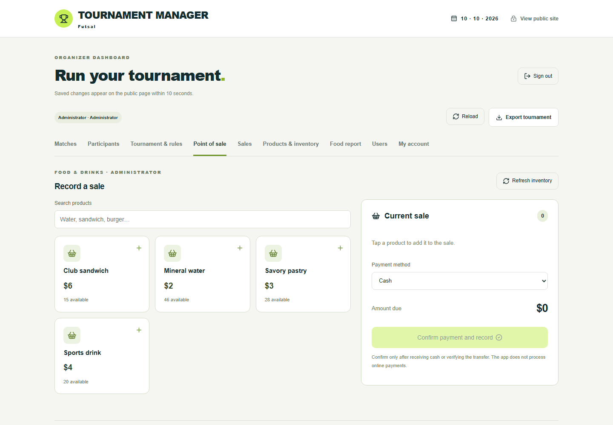
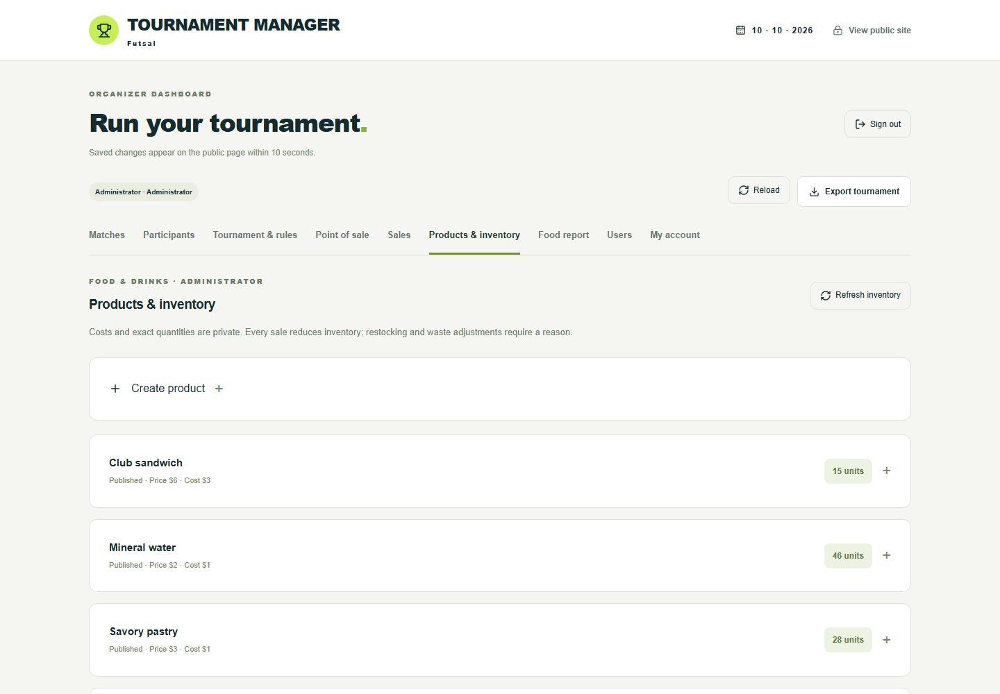
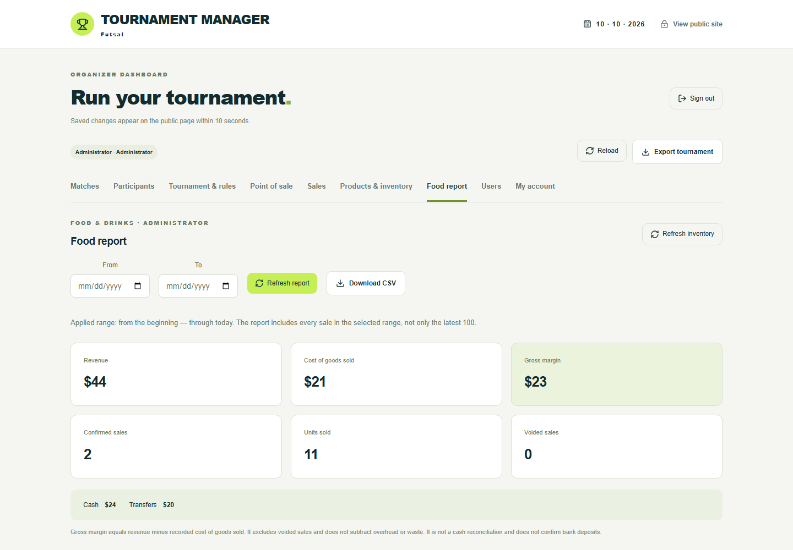

# Tournament Manager

[](https://github.com/geercaceres/gestor-torneos/actions/workflows/ci.yml)
[](LICENSE)

An open-source web application for running and publishing single-elimination sports tournaments. It works for padel, tennis, football, volleyball, basketball, esports, and other disciplines. Each installation can define its own name, sport, terminology, currency, rules, scoring, event days, and playing areas.

The interface supports **English and Spanish**. New installations and demo data default to English; existing Spanish installations keep their language during migration.

[Project website](https://geercaceres.github.io/gestor-torneos/) · [Source code](https://github.com/geercaceres/gestor-torneos)

[Quick start](docs/QUICKSTART.md) · [User guide](docs/USER-GUIDE.md) · [Configuration](docs/CONFIGURATION.md) · [Deployment](docs/DEPLOYMENT.md) · [FAQ](docs/FAQ.md) · [Roadmap](ROADMAP.md) · [Contributing](CONTRIBUTING.md)

## Features

- Responsive public site with live matches, schedule, results, bracket, participants, rules, location, transfer details, and menu.
- Administration panel for participants, schedules, calls, live matches, results, walkovers, announcements, and rules.
- Brackets with 2, 4, 8, 16, or 32 slots, multiple event days, and up to 8 playing areas.
- Set-based scoring or a generic winner plus free-form score.
- Optional point of sale and inventory: products, costs, prices, quantities, voids, and CSV reports.
- Server-enforced RBAC for administrators, organizers, food managers, and cashiers.
- TV or projector view at `/pantalla`.
- SQLite storage, audit history, and tournament export.
- Docker Compose and Caddy with automatic HTTPS.

Each installation currently manages one tournament. Multi-tenant hosting, online payments, public registration, and automatic notifications are outside the current scope.

## Gallery

| Public tournament page | Mobile view |
| --- | --- |
|  |  |

| Schedule and results | Single-elimination bracket |
| --- | --- |
|  |  |

| Match administration | Point of sale |
| --- | --- |
|  |  |

| Inventory | Sales report |
| --- | --- |
|  |  |

## Quick start with Docker

Requirements: Docker Engine and Docker Compose.

```sh
git clone https://github.com/geercaceres/gestor-torneos.git
cd gestor-torneos
docker run --rm --user "$(id -u):$(id -g)" -v "$PWD:/app" -w /app node:24-bookworm-slim node scripts/setup.mjs
docker compose up -d --build
```

The setup command creates `.env` and prints a random password for the `admin` account. Store it in a password manager. For a public deployment, edit:

```dotenv
PUBLIC_ORIGIN=https://tournaments.example.com
SITE_ADDRESS=tournaments.example.com
DATABASE_PATH=/data/tournament.sqlite
```

Open `/admin`, sign in as `admin`, and configure identity, language, sport, terminology, currency, dates, playing areas, scoring, participants, rules, and public links.

Caddy requests the TLS certificate and redirects HTTP to HTTPS. Do not expose port 3001 or SQLite to the Internet.

## Run on Windows

Install Node.js 24, then run:

```powershell
npm ci
npm run build:gcp
.\START-LOCAL.ps1
```

The first run generates local credentials. Administration is available at `http://localhost:3001/admin`.

## Development

```sh
npm ci
npm run setup:admin
```

Run the API and frontend in separate terminals:

```sh
node server/server.mjs
npm run dev
```

The development frontend uses `http://localhost:3000` and the local API uses port 3001.

Validation:

```sh
npm run typecheck
npm test
npm run build:gcp
```

## Demo data

Create a disposable database with sample participants, matches, results, products, inventory, sales, and users:

```sh
npm run setup:admin
npm run demo:seed -- data/demo.sqlite
DATABASE_PATH=data/demo.sqlite npm run build:gcp
DATABASE_PATH=data/demo.sqlite npm start
```

PowerShell:

```powershell
$env:DATABASE_PATH='data/demo.sqlite'
npm run build:gcp
npm start
```

The demo database is ignored by Git, contains only fictional English data, and is never overwritten by the seed script.

## Customization and languages

Use **Administration → Tournament & rules** to configure the interface language, identity, sport, participant and playing-area terms, currency, scoring, rules, contact details, Google Maps, WhatsApp, and transfer information.

The current competition engine supports single elimination. Group stages, leagues, and double elimination require additional competition engines; see the [roadmap](ROADMAP.md).

## Backups and updates

Create a consistent SQLite backup while the server is running:

```sh
docker compose exec app node scripts/backup.mjs /data/backups/tournament.sqlite
docker compose cp app:/data/backups/tournament.sqlite ./tournament-backup.sqlite
```

Store backups outside the server. Do not run `docker compose down -v` if you need to preserve data.

Before updating, create a backup and then run:

```sh
git pull
docker compose up -d --build
```

## Security

- Passwords use scrypt with a per-installation salt and are never stored as plaintext.
- Production cookies are HttpOnly, SameSite Strict, and Secure.
- RBAC is enforced on the server, with origin protection and rate limiting.
- Sales and inventory use transactions and revision checks.
- Rules, participant names, contact details, and configured public links are public information.

Report vulnerabilities privately to the repository owner. Never publish credentials, databases, or real participant data in an issue.

## License

[MIT](LICENSE). You may use, modify, and redistribute the project while preserving the license notice.
